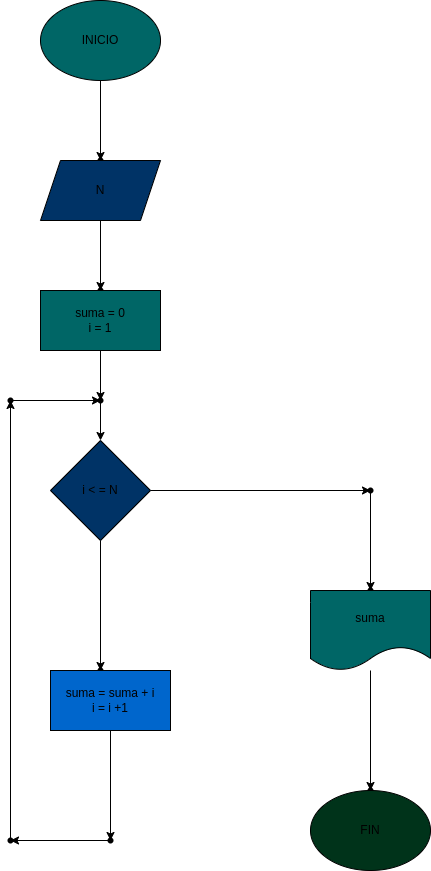

# suma-n-meros-naturales
suma de números naturales de acuerdo a un numero ingresado por el usuario

# ANALISIS

--Variables de entrada 
N : el numero ingresado para hacer la suma

--variables de proceso

suma : el resultado final de la suma de numeros "N"
i = la variables ingresa todos los numeros para ser sumados

--Variables de salida
suma : la suma echa
# DISEÑO

# CONSTRUCCION
